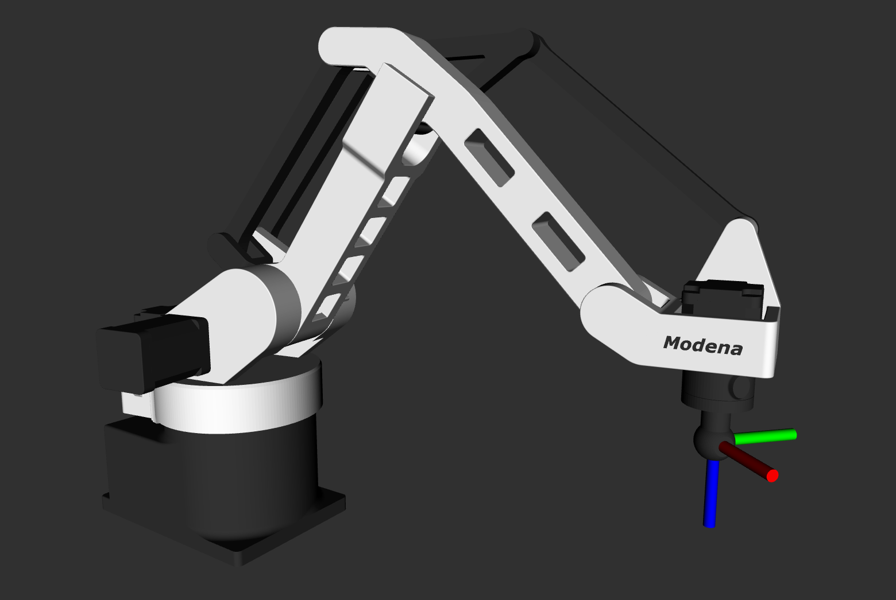

# MR-3 Mini Description
ROS2 description package for the MR-3 Mini palletizing robot.

Includes the robot URDF, STL meshes, RViz configuration and a launch file for interactive visualization using the joint sliders GUI.

Visualize and interact with the MR-3 Mini robot directly in RViz.



## Features
- Complete URDF model of the MR-3 Mini robot
- STL meshes for visualization
- Pre-configured RViz workspace
- Joint sliders GUI for interactive visualization
- TCP (Tool Center Point) visualization
- Mimic joints for realistic linkage motion

## Installation
This package assumes an existing ROS2 workspace.

Clone the repository into your ROS2 workspace:

```bash
cd ~/ros2_ws/src
git clone https://github.com/modena-robotics/mr3_mini_description.git
```

Build the package:

```bash
cd ~/ros2_ws
colcon build --packages-select mr3_mini_description
source install/setup.bash
```

## Launch
Launch RViz with the MR-3 Mini model and joint sliders GUI:

```bash
ros2 launch mr3_mini_description view_robot.launch.py
```

The launch file starts:
- robot_state_publisher
- joint_state_publisher_gui
- RViz2

allowing the user to visualize and interact with the robot model.

## Compatibility
Tested with ROS2 Jazzy.

## License
BSD 3-Clause License